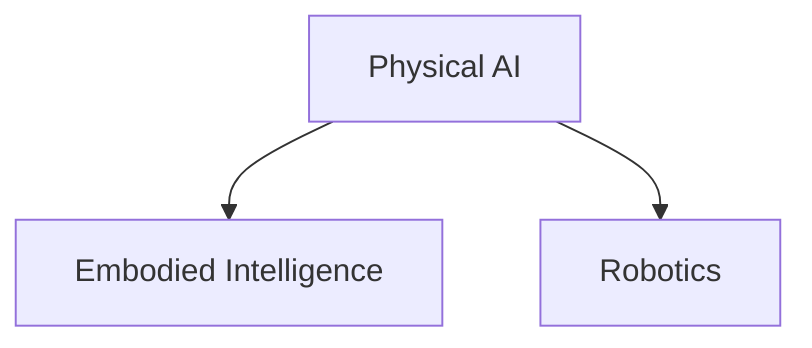

# Quickstart Guide: Physical AI & Humanoid Robotics Textbook

## Prerequisites

- Node.js (version 18 or higher)
- npm or yarn package manager
- Git (for version control)

## Setup Instructions

### 1. Clone the Repository
```bash
git clone [repository-url]
cd physical-ai-textbook
```

### 2. Install Dependencies
```bash
npm install
```

### 3. Start the Development Server
```bash
npm start
```
This command starts a local development server and opens the textbook in your default browser at `http://localhost:3000`.

### 4. Edit Content
- Textbook content is located in the `/docs` directory
- Each module is in its own subdirectory (e.g., `/docs/module-1/`)
- Edit existing content or add new sections using Markdown format

## Directory Structure

```
physical-ai-textbook/
├── docs/                 # All textbook content
│   ├── module-1/         # Physical AI fundamentals
│   ├── module-2/         # ROS 2 as robotic nervous system
│   ├── module-3/         # Simulation and AI integration
│   ├── module-4/         # Vision-Language-Action systems
│   └── hardware/         # Informational content
├── src/                  # Custom React components
│   └── components/       # Textbook-specific components
├── static/               # Static assets
│   ├── img/              # Images and diagrams
│   └── media/            # Additional media files
├── docusaurus.config.js  # Website configuration
└── package.json          # Project dependencies and scripts
```

## Adding New Content

### To add a new section to an existing module:
1. Create a new `.md` file in the appropriate module directory
2. Add an entry for the new file in `sidebars.js`
3. Use the frontmatter template to specify metadata

### To create a new module (advanced):
1. Create a new directory under `/docs/`
2. Add an index.md file as the entry point
3. Add module content as separate `.md` files
4. Update `sidebars.js` to include the new module

## Frontmatter Template

Each Markdown file should begin with metadata:

```markdown
---
title: Title of the Section
description: Brief description of what this section covers
sidebar_position: Integer indicating position in sidebar
---
```

## Special Content Features

### Mathematical Equations
Use LaTeX syntax within dollar signs:
```markdown
$F = ma$ represents Newton's second law.
```

### Diagrams
Use Mermaid syntax for creating diagrams:
```

```

### Key Terms
Define important terms using this syntax:
```markdown
<Term name="Physical AI">AI systems that interact with and operate in the physical world.</Term>
```

## Building for Production

To build the static version of the textbook:
```bash
npm run build
```

The output will be in the `/build` directory and can be deployed to any static hosting service.

## Custom Components

The textbook includes custom components for educational purposes:

- `LearningObjectives`: List learning outcomes
- `KeyTakeaways`: Highlight important concepts
- `PracticeQuestions`: Include questions for self-assessment